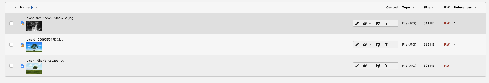
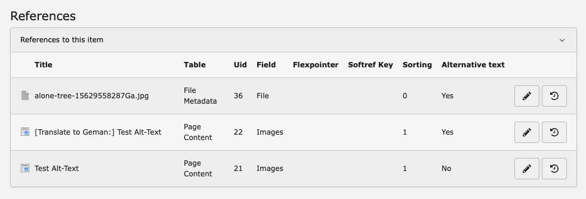

================
For Editors
================
Warning icon in the File List
-----------------------------

The extension hooks into TYPO3's icon rendering via the PSR-14 ``ModifyIconForResourcePropertiesEvent``. It adds an ``overlay-warning`` icon to any file in the **File List** module when:

- the file itself has no alternative text set in ``sys_file_metadata``, **or**
- any of its file references has no alternative text set in ``sys_file_reference``

This gives editors a quick visual cue to identify images that need attention before publishing.

"Alternative text" column in reference tables
---------------------------------------------

The extension overrides the backend ``ElementInformation`` template to add an **Alternative text** column to the "References to this item" table. The column shows:

.. list-table::
   :header-rows: 1

   * - Value
     - Meaning
   * - Yes
     - All file references for this relation have alternative text set
   * - No
     - At least one file reference for this relation is missing alternative text

The column is visible when viewing the info panel of any file in the backend (click the info icon next to a file in the File List).

How to use
----------

1. Open the **File** module in the TYPO3 backend.
2. Navigate to the folder containing your images.
3. Any image with a yellow warning overlay icon is missing alternative text — either at the file level or in one of its references.
4. Click the **info icon** (ℹ) next to a file to open the element information panel.
5. Scroll to the **References** section. The **Alternative text** column shows ``Yes`` or ``No`` for each relation.
6. To fix a missing alt text:

   - **At file level:** Edit the file metadata and fill in the **Alternative Text** field (``sys_file_metadata.alternative``).
   - **At reference level:** Edit the content element or record that references the file and fill in the **Alternative Text** field on the image relation.

Once all missing alt texts are filled in and the cache is cleared, the warning icon disappears.

Localization
------------

The extension ships with English and German translations. To add your own language, create a translation file.

